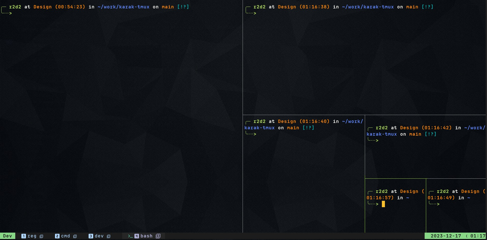

# Karak Tmux

A clean, dark Tmux theme that gives a tribute to district [Karak.](https://www.flickr.com/photos/158416209@N08/32490822757)

### Installation using TPM

In your `tmux.conf`:
```
set -g @plugin "aamir-sultan/karak-tmux"
# set -g @theme_variation 'edge-dark'
# set -g @theme_variation 'edge-light'
set -g @theme_variation 'everforest-dark'
# set -g @theme_variation 'everforest-light'
# set -g @theme_variation 'gruvbox-material-dark'
# set -g @theme_variation 'gruvbox-material-light'
# set -g @theme_variation 'gruvbox-mix-dark'
# set -g @theme_variation 'soft-era'
# set -g @theme_variation 'sonokai'
# set -g @theme_variation 'sonokai-andromeda'
# set -g @theme_variation 'sonokai-atlantis'
# set -g @theme_variation 'sonokai-espresso'
# set -g @theme_variation 'sonokai-maia'
# set -g @theme_variation 'sonokai-shusia'
```

### Karak Night Theme

Colors are mostly hardcoded for now. May improve it at late stages.

Improvements:
- Better scripts handling.
- Cmus status has a progress bar
- Git scripts has diff status
- Windows has custom seven-segmented display number style
- Better terminal icons




